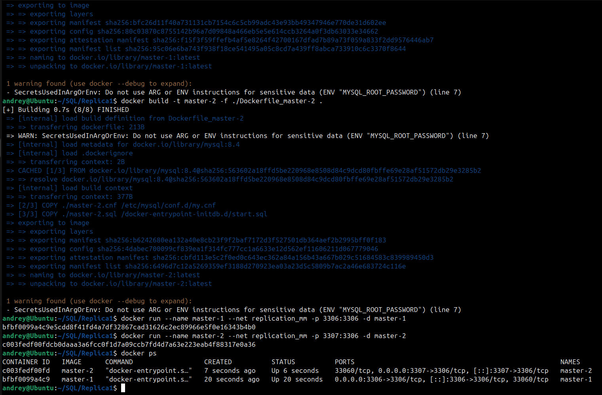
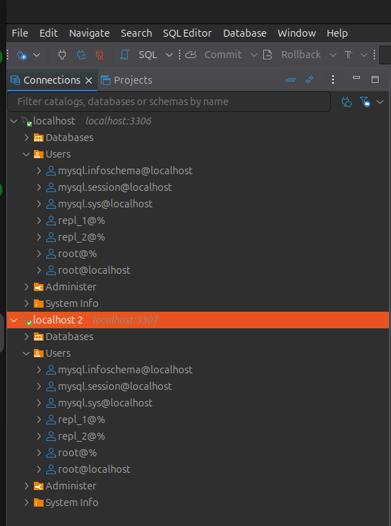
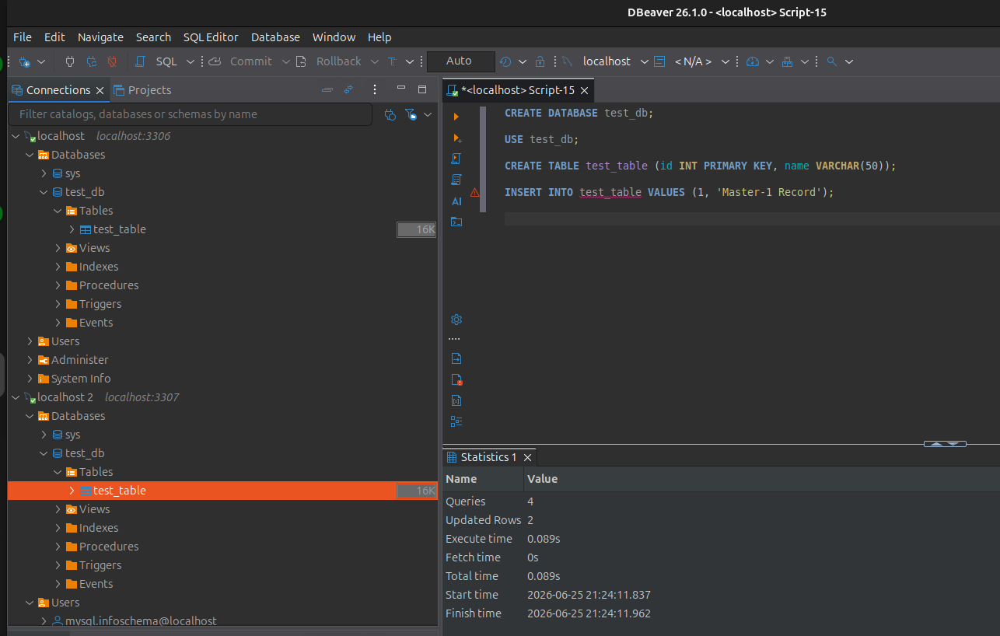
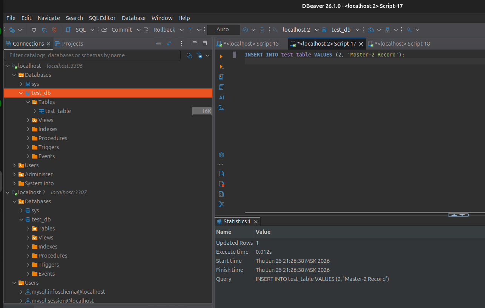
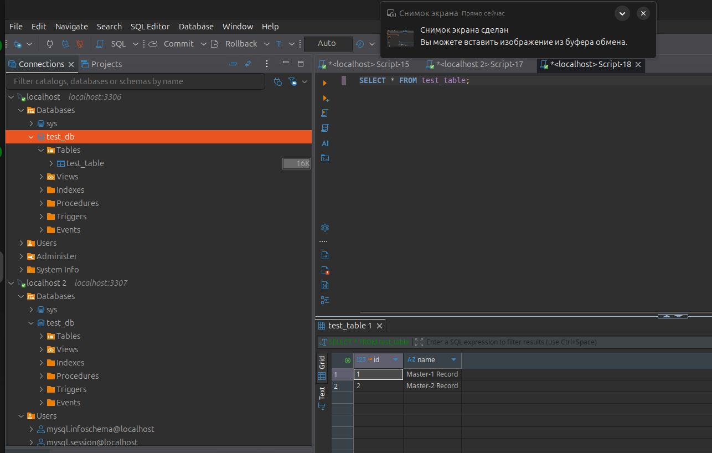

# Домашнее задание к занятию "`Репликация и масштабирование`" - `Кочнев Андрей`

### Инструкция по выполнению домашнего задания

   1. Сделайте `fork` данного репозитория к себе в Github и переименуйте его по названию или номеру занятия, например, https://github.com/имя-вашего-репозитория/git-hw или  https://github.com/имя-вашего-репозитория/7-1-ansible-hw).
   2. Выполните клонирование данного репозитория к себе на ПК с помощью команды `git clone`.
   3. Выполните домашнее задание и заполните у себя локально этот файл README.md:
      - впишите вверху название занятия и вашу фамилию и имя
      - в каждом задании добавьте решение в требуемом виде (текст/код/скриншоты/ссылка)
      - для корректного добавления скриншотов воспользуйтесь [инструкцией "Как вставить скриншот в шаблон с решением](https://github.com/netology-code/sys-pattern-homework/blob/main/screen-instruction.md)
      - при оформлении используйте возможности языка разметки md (коротко об этом можно посмотреть в [инструкции  по MarkDown](https://github.com/netology-code/sys-pattern-homework/blob/main/md-instruction.md))
   4. После завершения работы над домашним заданием сделайте коммит (`git commit -m "comment"`) и отправьте его на Github (`git push origin`);
   5. Для проверки домашнего задания преподавателем в личном кабинете прикрепите и отправьте ссылку на решение в виде md-файла в вашем Github.
   6. Любые вопросы по выполнению заданий спрашивайте в чате учебной группы и/или в разделе “Вопросы по заданию” в личном кабинете.

Желаем успехов в выполнении домашнего задания!

### Дополнительные материалы, которые могут быть полезны для выполнения задания

1. [Руководство по оформлению Markdown файлов](https://gist.github.com/Jekins/2bf2d0638163f1294637#Code)

---
### Задание 1

Master-Slave

В этой схеме есть один основной сервер (master), который принимает все записи, и один или несколько подчинённых (slave), которые копируют изменения и обычно обслуживают чтение.
Такой режим проще в настройке и хорошо подходит для сценариев, где записей мало, а чтений много.
Если мастер падает, чтение с реплик может продолжаться, но запись обычно становится недоступной до переключения ролей.
Master-Master

В этой схеме несколько узлов могут принимать записи, а изменения синхронизируются между ними.
Это даёт лучшую гибкость и может повысить доступность записи, но цена — более сложная настройка и необходимость решать конфликты, если разные узлы одновременно меняют одни и те же данные.
На практике master-master часто используют реже, потому что управление конфликтами и согласованностью заметно усложняет систему.
Главное отличие

    Master-Slave: запись только на одном узле, реплики в основном для чтения и отказоустойчивости.

    Master-Master: запись возможна на нескольких узлах, но нужна логика синхронизации и разрешения конфликтов.

Когда что выбирать

Master-Slave обычно выбирают, если важны простота, предсказуемость и разгрузка чтения.
Master-Master имеет смысл, когда нужно писать в несколько узлов и система готова к более сложной архитектуре и конфликтам

### Задание 2

---

### Задание 3

