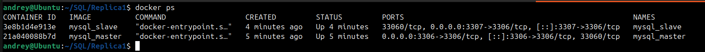
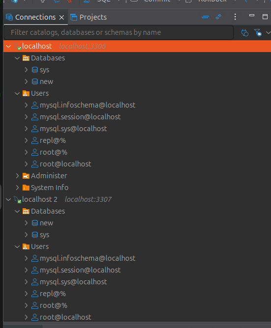
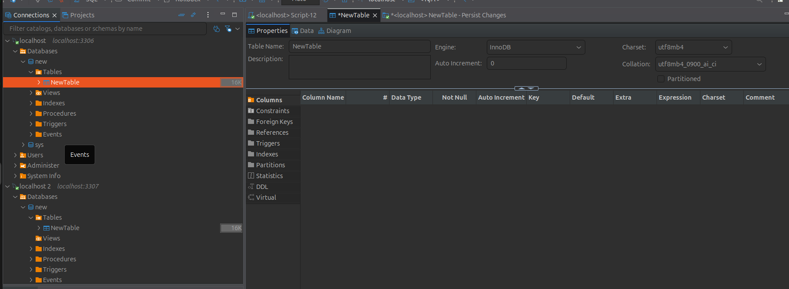
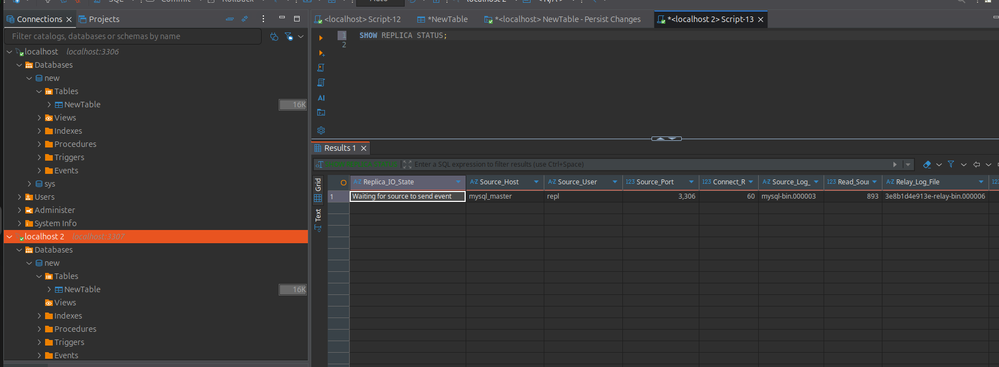
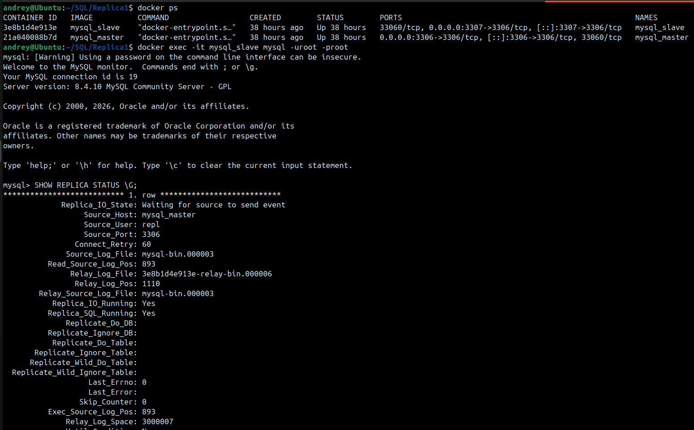
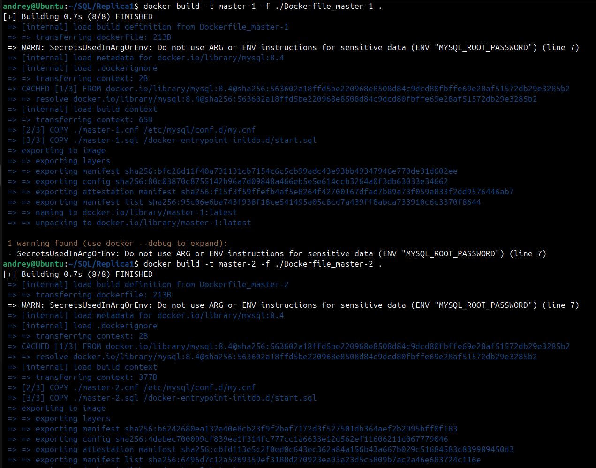

# Домашнее задание к занятию "`Репликация и масштабирование`" - `Кочнев Андрей`

### Инструкция по выполнению домашнего задания

   1. Сделайте `fork` данного репозитория к себе в Github и переименуйте его по названию или номеру занятия, например, https://github.com/имя-вашего-репозитория/git-hw или  https://github.com/имя-вашего-репозитория/7-1-ansible-hw).
   2. Выполните клонирование данного репозитория к себе на ПК с помощью команды `git clone`.
   3. Выполните домашнее задание и заполните у себя локально этот файл README.md:
      - впишите вверху название занятия и вашу фамилию и имя
      - в каждом задании добавьте решение в требуемом виде (текст/код/скриншоты/ссылка)
      - для корректного добавления скриншотов воспользуйтесь [инструкцией "Как вставить скриншот в шаблон с решением](https://github.com/netology-code/sys-pattern-homework/blob/main/screen-instruction.md)
      - при оформлении используйте возможности языка разметки md (коротко об этом можно посмотреть в [инструкции  по MarkDown](https://github.com/netology-code/sys-pattern-homework/blob/main/md-instruction.md))
   4. После завершения работы над домашним заданием сделайте коммит (`git commit -m "comment"`) и отправьте его на Github (`git push origin`);
   5. Для проверки домашнего задания преподавателем в личном кабинете прикрепите и отправьте ссылку на решение в виде md-файла в вашем Github.
   6. Любые вопросы по выполнению заданий спрашивайте в чате учебной группы и/или в разделе “Вопросы по заданию” в личном кабинете.

Желаем успехов в выполнении домашнего задания!

### Дополнительные материалы, которые могут быть полезны для выполнения задания

1. [Руководство по оформлению Markdown файлов](https://gist.github.com/Jekins/2bf2d0638163f1294637#Code)

---

### Задание 1

---

### Задание 2

Вертикальное разделение (по таблицам)

    Вынести таблицы с разной нагрузкой на разные серверы

    пользователи → сервис аутентификации (частые чтения по ID)

    книги → сервис контента (частые чтения, поисковые запросы)

    магазины → сервис транзакций (частые записи, обновления)

Горизонтальное разделение (по строкам)

    пользователи: шардирование по user_id (range-based или hash-based)

    книги: шардирование по category_id или book_id

    магазины: шардирование по region_id или shop_id

2. План выполнения шардирования
Этап 1: Подготовка

    Анализ нагрузки

        Исследовать паттерны чтения/записи для каждой таблицы

        Определить критические пути доступа к данным

        Выястить hotspots (точки высокой нагрузки)

    Выбор стратегии шардирования

        Hash-based шардирование для пользователей: shard_id = hash(user_id) % N

        Range-based шардирование для книг: по категориям

        Directory-based для магазинов: по регионам

    Определение числа шардов

        Начать с 3-4 шардов для каждого типа данных

        Планировать масштабируемость до 10+ шардов

Этап 2: Вертикальное шардирование

    Разделение таблиц на разные серверы

    text
    Сервер 1: users_db (таблица пользователи)
    Сервер 2: books_db (таблица книги)
    Сервер 3: shops_db (таблица магазины)

    Создание сервисного слоя

        API для каждого сервиса (пользователи, книги, магазины)

        Routing layer для маршрутизации запросов

        Транзакционная координация между сервисами

    Обработка внешних ключей

        Создать reference tables для связей

        Использовать асинхронную синхронизацию данных

Этап 3: Горизонтальное шардирование

    Шардирование таблицы пользователей

        Критерий: user_id (hash-based)

        Пример распределения:

            Шард 1: пользователи 1-100

            Шард 2: пользователи 101-200

            Шард 3: пользователи 201-300

    Шардирование таблицы книги

        Критерий: category_id (range-based)

        Пример:

            Шард 1: категории 1-10 (литература)

            Шард 2: категории 11-20 (наука)

            Шард 3: категории 21-30 (художественная)

    Шардирование таблицы магазины

        Критерий: region_id (directory-based)

        Пример:

            Шард 1: регионы 1-5 (Центр)

            Шард 2: регионы 6-10 (Юг)

            Шард 3: регионы 11-15 (Сибирь)

Этап 4: Миграция данных

    Двойная запись (dual-write)

        Записывать данные в старую и новую БД одновременно

        Синхронизировать данные асинхронно

    Постепенная миграция

        Мигрировать по частям (по user_id ranges)

        Проверять целостность после каждой части

    Переключение чтения

        Сначала переключить чтение на шарды

        Затем переключить запись

        Отключить старую БД

Этап 5: Оптимизация и мониторинг

    Настройка балансировки

        Ребалансировка при неравномерной нагрузке

        Автоматическое добавление шардов

    Мониторинг

        Latency между шардами

        Load balancing эффективность

        Integrity checks

┌─────────────────────────────────────────────────────────────────────────┐
│                         APPLICATION LAYER                               │
│  ┌───────────┐  ┌───────────┐  ┌───────────┐  ┌─────────────────────┐  │
│  │   Web     │  │  Mobile   │  │   API     │  │  Request Router     │  │
│  │  Clients  │  │  Clients  │  │ Gateway   │  │  (Shard Router)     │  │
│  └───────────┘  └───────────┘  └───────────┘  └─────────────────────┘  │
└─────────────────────────────────────────────────────────────────────────┘
                                      │
                                      ▼
┌─────────────────────────────────────────────────────────────────────────┐
│                        SERVICE LAYER (Microservices)                    │
│  ┌──────────────────┐  ┌──────────────────┐  ┌──────────────────┐      │
│  │  Users Service   │  │  Books Service   │  │  Shops Service   │      │
│  │  (Auth + Profile)│  │  (Catalog + SEO) │  │  (Transactions)  │      │
│  └──────────────────┘  └──────────────────┘  └──────────────────┘      │
└─────────────────────────────────────────────────────────────────────────┘
                                      │
                                      ▼
┌─────────────────────────────────────────────────────────────────────────┐
│                         DATABASE LAYER (Sharded)                        │
│                                                                           │
│  ┌──────────────────────────────────────────────────────────────────┐  │
│  │                    USERS DATABASE SHARDS (Horizontal)             │  │
│  │  ┌─────────────┐  ┌─────────────┐  ┌─────────────┐               │  │
│  │  │ Users Shard │  │ Users Shard │  │ Users Shard │               │  │
│  │  │     1       │  │     2       │  │     3       │               │  │
│  │  │ user_id:    │  │ user_id:    │  │ user_id:    │               │  │
│  │  │ 1-100       │  │ 101-200     │  │ 201-300     │               │  │
│  │  │ (hash)      │  │ (hash)      │  │ (hash)      │               │  │
│  │  └─────────────┘  └─────────────┘  └─────────────┘               │  │
│  └──────────────────────────────────────────────────────────────────┘  │
│                                                                           │
│  ┌──────────────────────────────────────────────────────────────────┐  │
│  │                    BOOKS DATABASE SHARDS (Horizontal)             │  │
│  │  ┌─────────────┐  ┌─────────────┐  ┌─────────────┐               │  │
│  │  │ Books Shard │  │ Books Shard │  │ Books Shard │               │  │
│  │  │     1       │  │     2       │  │     3       │               │  │
│  │  │ category:   │  │ category:   │  │ category:   │               │  │
│  │  │ 1-10        │  │ 11-20       │  │ 21-30       │               │  │
│  │  │ (range)     │  │ (range)     │  │ (range)     │               │  │
│  │  └─────────────┘  └─────────────┘  └─────────────┘               │  │
│  └──────────────────────────────────────────────────────────────────┘  │
│                                                                           │
│  ┌──────────────────────────────────────────────────────────────────┐  │
│  │                   SHOPS DATABASE SHARDS (Horizontal)              │  │
│  │  ┌─────────────┐  ┌─────────────┐  ┌─────────────┐               │  │
│  │  │ Shops Shard │  │ Shops Shard │  │ Shops Shard │               │  │
│  │  │     1       │  │     2       │  │     3       │               │  │
│  │  │ region:     │  │ region:     │  │ region:     │               │  │
│  │  │ 1-5         │  │ 6-10        │  │ 11-15       │               │  │
│  │  │ (dir)       │  │ (dir)       │  │ (dir)       │               │  │
│  │  └─────────────┘  └─────────────┘  └─────────────┘               │  │
│  └──────────────────────────────────────────────────────────────────┘  │
│                                                                           │
└─────────────────────────────────────────────────────────────────────────┘
                                      │
                                      ▼
┌─────────────────────────────────────────────────────────────────────────┐
│                      SUPPORTING SERVICES                                │
│  ┌──────────────┐  ┌──────────────┐  ┌──────────────┐                  │
│  │   Cache      │  │    Queue     │  │  Monitor     │                  │
│  │   (Redis)    │  │   (RabbitMQ) │  │   (Prom)     │                  │
│  │   L1/L2      │  │  Transactions│  │   + Grafana  │                  │
│  └──────────────┘  └──────────────┘  └──────────────┘                  │
└─────────────────────────────────────────────────────────────────────────┘

Расположение компонентов по серверам

Сервер	   Роль	               Компоненты	                                          Таблицы
Server 1	   Users DB Cluster	   Users Shard 1, 2, 3	                                 пользователи
Server 2	   Books DB Cluster	   Books Shard 1, 2, 3	                                 книги
Server 3	   Shops DB Cluster	   Shops Shard 1, 2, 3	                                 магазины
Server 4	   Application	         Users Service, Books Service, Shops Service, Router	-
Server 5	   Supporting	         Redis Cache, RabbitMQ, Prometheus	                  -
---

### Задание 3

Основные преимущества схемы с активным master-сервером и пассивным репликационным slave-сервером — это повышение производительности чтения, рост отказоустойчивости и более быстрое переключение при сбое master-сервера. Такая архитектура особенно полезна, когда операций чтения больше, чем записи, а данные нужно держать в актуальном состоянии на резервной копии.
Ключевые преимущества

    Распределение нагрузки на чтение между master и replica снижает давление на основной сервер и ускоряет обработку запросов.

    Если master выходит из строя, slave можно быстро назначить новым master, что уменьшает простой сервиса.

    Появляется дополнительная копия данных, поэтому повышается надежность и доступность системы.

    Репликация помогает обслуживать растущий объем запросов без немедленного усложнения архитектуры приложения.

Когда это особенно полезно

    Для веб-приложений с большим числом чтений и сравнительно редкими изменениями данных.

    Для систем, где важны быстрое восстановление после отказа и минимизация времени недоступности.

    Для сценариев, где резервный сервер нужен не только для аварийного переключения, но и для постоянного снятия части нагрузки с master.

Ограничения

У такой схемы есть и минусы: записи всё равно проходят через master, поэтому она не решает проблему масштабирования записи так же хорошо, как горизонтальное распределение данных. Кроме того, репликация может давать задержку между master и slave, из-за чего чтение с реплики иногда показывает немного устаревшие данные.

Схема «мастер-сервер и несколько подчиненных серверов» дает три главных преимущества: более высокую скорость чтения, лучшую отказоустойчивость и удобное масштабирование нагрузки на несколько узлов.
Что это дает

    Чтение можно распределять между несколькими подчиненными серверами, поэтому общий отклик системы становится быстрее.

    При отказе master-сервера можно быстро назначить один из подчиненных новым master, что сокращает простой.

    Несколько реплик повышают избыточность и, как следствие, надежность и доступность сервиса.

    Добавлять новые подчиненные серверы проще, чем перестраивать архитектуру под более тяжелую нагрузку.

Важный нюанс

Запись данных при такой схеме обычно все равно остается на master-сервере, поэтому она хорошо решает нагрузку на чтение, но не устраняет полностью узкое место записи. Также у реплик может быть небольшая задержка синхронизации, из-за чего данные на них иногда чуть менее актуальны, чем на master.

Активный сервер со специальным механизмом репликации DRBD — это схема, где данные реплицируются на уровне блочных устройств по сети, а при отказе локального диска сервис продолжает работать с удалённой копией данных.
Основные преимущества

    Повышается отказоустойчивость: при сбое дисковой подсистемы или хранилища основной узел может продолжить работу за счёт сетевой реплики.

    Упрощается восстановление после аварии, потому что актуальная копия данных уже находится на втором узле.

    DRBD можно использовать как основу для кластера высокой доступности, когда важна непрерывность сервиса.

    Подходит для сценариев, где нужно быстро организовать резервирование хранилища без перестройки приложения на уровне логики работы с данными.

Важные ограничения

DRBD не заменяет полноценное масштабирование записи: он в первую очередь решает задачу репликации и отказоустойчивости хранения.
При синхронной репликации производительность записи зависит от задержки сети между узлами, а при неправильной конфигурации возможен риск split-brain.

      САН-кластер — это кластер серверов, который использует общую систему хранения данных SAN, чтобы несколько узлов имели разделяемый доступ к дискам и могли работать как единая отказоустойчивая система.
Что дает SAN-кластер

    Общий доступ к хранилищу для нескольких серверов, что упрощает совместную работу узлов с одними и теми же данными.

    Повышенная отказоустойчивость: при сбое одного сервера или части инфраструктуры другой узел может продолжить обслуживание.

    Хорошая масштабируемость: можно добавлять новые серверы и расширять дисковую емкость без остановки всей системы.

    Более высокая производительность хранения за счет специализированной SAN-инфраструктуры и распределения нагрузки по узлам.

Где это полезно

Такой подход часто используют там, где важны непрерывная доступность сервисов, быстрый рост инфраструктуры и возможность обслуживать общие данные несколькими серверами одновременно.
SAN-кластер особенно уместен для виртуализации, баз данных и приложений, которым нужно общее блочное хранилище с высокой доступностью.
Ограничения

SAN-кластер обычно сложнее и дороже в проектировании, чем схема с одним сервером или простой репликацией, потому что требует отдельной сети хранения и более тщательного администрирования.
Если нужен, могу кратко сравнить SAN-кластер с DRBD и классической master-slave репликацией.

---

### Задание 4

Реализовано вертикальное разделение по таблицам и горизонтальное по строкам внутри таблиц для задания 2, сделано в Docker-песочнице через отдельные PostgreSQL-контейнеры без внешнего шард-координатора.

Таблица users — горизонтальный шардинг по user_id через диапазоны.

Таблица books — горизонтальный шардинг по book_id через хеш/остаток от деления.

Таблица stores — вертикальное разделение:

    stores_core — основные поля,

    stores_meta — дополнительные поля,
    при необходимости обе части можно дополнительно дробить по регионам.

Далее пример docker-compose.yml для 1 узла-координатора и 6 узлов-шардов.

version: "3.9"

services:
  coordinator:
    image: postgres:16
    container_name: db_coordinator
    restart: unless-stopped
    environment:
      POSTGRES_DB: appdb
      POSTGRES_USER: app
      POSTGRES_PASSWORD: apppass
    ports:
      - "5432:5432"
    volumes:
      - coord_data:/var/lib/postgresql/data
      - ./sql:/docker-entrypoint-initdb.d

  users_s1:
    image: postgres:16
    container_name: users_s1
    restart: unless-stopped
    environment:
      POSTGRES_DB: appdb
      POSTGRES_USER: app
      POSTGRES_PASSWORD: apppass
    ports:
      - "5433:5432"
    volumes:
      - users_s1_data:/var/lib/postgresql/data
      - ./sql:/docker-entrypoint-initdb.d

  users_s2:
    image: postgres:16
    container_name: users_s2
    restart: unless-stopped
    environment:
      POSTGRES_DB: appdb
      POSTGRES_USER: app
      POSTGRES_PASSWORD: apppass
    ports:
      - "5434:5432"
    volumes:
      - users_s2_data:/var/lib/postgresql/data
      - ./sql:/docker-entrypoint-initdb.d

  books_s1:
    image: postgres:16
    container_name: books_s1
    restart: unless-stopped
    environment:
      POSTGRES_DB: appdb
      POSTGRES_USER: app
      POSTGRES_PASSWORD: apppass
    ports:
      - "5435:5432"
    volumes:
      - books_s1_data:/var/lib/postgresql/data
      - ./sql:/docker-entrypoint-initdb.d

  books_s2:
    image: postgres:16
    container_name: books_s2
    restart: unless-stopped
    environment:
      POSTGRES_DB: appdb
      POSTGRES_USER: app
      POSTGRES_PASSWORD: apppass
    ports:
      - "5436:5432"
    volumes:
      - books_s2_data:/var/lib/postgresql/data
      - ./sql:/docker-entrypoint-initdb.d

  stores_s1:
    image: postgres:16
    container_name: stores_s1
    restart: unless-stopped
    environment:
      POSTGRES_DB: appdb
      POSTGRES_USER: app
      POSTGRES_PASSWORD: apppass
    ports:
      - "5437:5432"
    volumes:
      - stores_s1_data:/var/lib/postgresql/data
      - ./sql:/docker-entrypoint-initdb.d

  stores_s2:
    image: postgres:16
    container_name: stores_s2
    restart: unless-stopped
    environment:
      POSTGRES_DB: appdb
      POSTGRES_USER: app
      POSTGRES_PASSWORD: apppass
    ports:
      - "5438:5432"
    volumes:
      - stores_s2_data:/var/lib/postgresql/data
      - ./sql:/docker-entrypoint-initdb.d

volumes:
  coord_data:
  users_s1_data:
  users_s2_data:
  books_s1_data:
  books_s2_data:
  stores_s1_data:
  stores_s2_data:

Ниже единый sharding.sql, который можно положить в ./sql/ и выполнить на каждом контейнере. Он создаёт таблицы и пример маршрутизирующей логики через функции. Стиль с отдельными физическими таблицами и функциями маршрутизации соответствует ручному шардированию PostgreSQL.

CREATE TABLE IF NOT EXISTS users_shard_1 (
    user_id BIGINT PRIMARY KEY,
    full_name TEXT NOT NULL,
    email TEXT NOT NULL,
    created_at TIMESTAMP NOT NULL DEFAULT now()
);

CREATE TABLE IF NOT EXISTS users_shard_2 (
    user_id BIGINT PRIMARY KEY,
    full_name TEXT NOT NULL,
    email TEXT NOT NULL,
    created_at TIMESTAMP NOT NULL DEFAULT now()
);

CREATE TABLE IF NOT EXISTS books_shard_1 (
    book_id BIGINT PRIMARY KEY,
    title TEXT NOT NULL,
    author TEXT NOT NULL,
    price NUMERIC(10,2) NOT NULL
);

CREATE TABLE IF NOT EXISTS books_shard_2 (
    book_id BIGINT PRIMARY KEY,
    title TEXT NOT NULL,
    author TEXT NOT NULL,
    price NUMERIC(10,2) NOT NULL
);

CREATE TABLE IF NOT EXISTS stores_core (
    store_id BIGINT PRIMARY KEY,
    store_name TEXT NOT NULL,
    city TEXT NOT NULL,
    region TEXT NOT NULL
);

CREATE TABLE IF NOT EXISTS stores_meta (
    store_id BIGINT PRIMARY KEY,
    address TEXT,
    phone TEXT,
    opening_hours TEXT
);

CREATE OR REPLACE FUNCTION route_user_shard(p_user_id BIGINT)
RETURNS INT
LANGUAGE plpgsql
AS $$
BEGIN
    IF p_user_id % 2 = 0 THEN
        RETURN 2;
    ELSE
        RETURN 1;
    END IF;
END;
$$;

CREATE OR REPLACE FUNCTION route_book_shard(p_book_id BIGINT)
RETURNS INT
LANGUAGE plpgsql
AS $$
BEGIN
    IF p_book_id % 2 = 0 THEN
        RETURN 2;
    ELSE
        RETURN 1;
    END IF;
END;
$$;

CREATE OR REPLACE FUNCTION route_store_group(p_region TEXT)
RETURNS INT
LANGUAGE plpgsql
AS $$
BEGIN
    IF p_region IN ('South', 'Center') THEN
        RETURN 1;
    ELSE
        RETURN 2;
    END IF;
END;
$$;

Coordinator: read/write, принимает запросы приложения и решает, в какой шард писать.

Shard nodes: read/write в пределах своего набора данных.

Для stores: stores_core — основной режим записи, stores_meta — дополнительный контур, часто read-mostly.
---